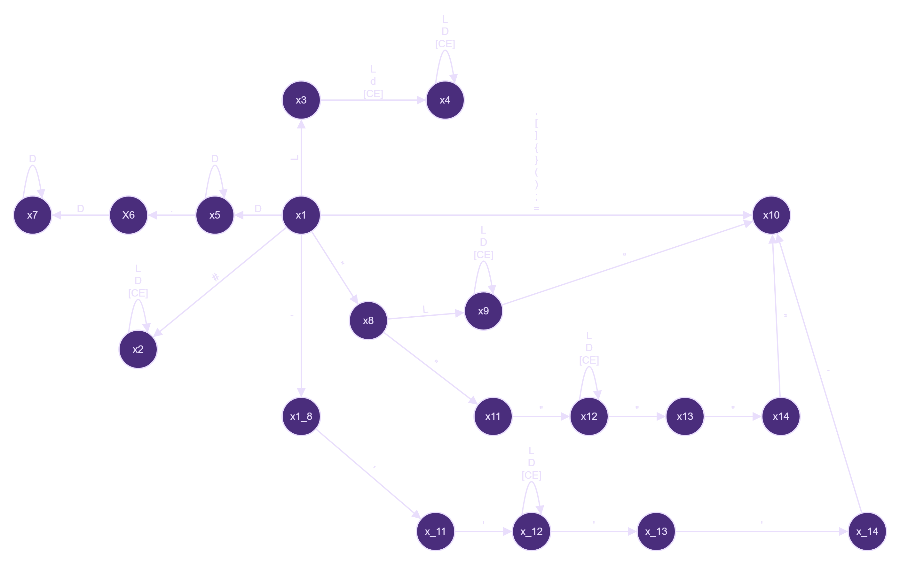

<h1 align="center">Manual Técnico</h1>

<div align="center">
🙍‍♂️ Joab Israel Ajsivinac Ajsivinac 🆔 202200135
</div>
<div align="center">
📕 Lenguajes Formales y de Programación
</div>
<div align="center"> 🏛 Universidad San Carlos de Guatemala</div>
<div align="center"> 📆 Segundo Semestre 2023</div>

<!-- Tabla de Contenidos -->
## 📋 Tabla de Contenidos

<!-- - [📋 Tabla de Contenidos](#-tabla-de-contenidos) -->
- [📋 Tabla de Contenidos](#-tabla-de-contenidos)
- [⚒ Requerimientos](#-requerimientos)
- [⚙ Tecnologías Utilizadas](#-tecnologías-utilizadas)
- [⚽ Objetivos](#-objetivos)
- [🧮 Como funciona](#-como-funciona)
  - [Método del árbol](#método-del-árbol)
- [📟 Instalación](#-instalación)
- [📷 Capturas](#-capturas)


<!-- Requerimientos -->
## ⚒ Requerimientos

<ul>
  <li>Windows 8 o Superior</li>
  <li>macOS Catalina o Superior</li>
  <li>Linux: Ubuntu, Debian, CentOS, Fedora, etc.</li>
  <li>Python 3.10.8 o Superior</li>
  <li>Tkinter 8.6 o superior</li>
  <li>Graphviz 0.20 o superior</li>
  <li>Pillow 10.0.1 o Superior</li>
  <li>sv_ttk</li>
  <br>
  <li>Fuentes</li>
  <ul>
  <li>Montserrat </li>
  <li>Cascadia Code</li></ul>
  
</ul>

## ⚙ Tecnologías Utilizadas

<div align="center" style="display:flex;justify-content:center;gap:20px">
 <a href="https://skillicons.dev">
    
  </a>
</div>
<ul>
  <li>Python</li>
  <li>Visual Studio Code</li>
  <li>Git</li>
  <li>Graphviz</li>
  <li>Automatarium</li>
</ul>

## ⚽ Objetivos
* **Objetivo General**
    * Diseñar y desarrollar una aplicación con entorno visual que contenga un analizador léxico y sintáctico que lea instrucciones determiandas.
* **Objetivos Específicos**
    * Elaborar un sistema que proporcione una interfaz agradable a la vista para interactuar con los analizadores de una forma intuitiva.
    * Generar gráficas para la visualización correcta del orden de las opeaciones por medio de la libreria Graphviz de Python
    * Obtener reportes en formato `html` de los resultados de los analizadores

## 🧮 Como funciona

<h3>Clase App</h3>

```python
class App(tk.Tk):
```
Esta clase se encarga de la interfaz gráfica, heredando elementos de tk, para poder utilizarlos dentro de la clase, aquí se definen
las propiedades básicas de la ventana, como el tamaño, el titulo de la ventana, el tema a utilizar, configuraciones de algunos elementos gráficos, etc.

<h3>Clase Contenido</h3>

```python
class Contendio(ttk.Frame):
```

Esta clase se encarga de crear un Frame principal, dentro del cual estarán todos los elementos visuales como: botones, etiquetas, cuadros de texto, etc.

Los siguiente métodos forman parte de la clase Contendio.
<br>

<blockquote>

**Método crear_menu_superior**

```python
def crear_menu_superior(self):
```
Se encarga de crear un Frame para la parte superior donde se encuentran los botones de abrir, y el menu donde se puede seleccionar el tipo de reporte que se desea visualizar.

</blockquote>
<br>
<blockquote>

**Método crear_medio**

```python
def crear_medio(self):
```
Se encarga de crear un panel donde poder agregar el text Area donde se puede escribir el codigo junto con la consola donde se veran los resultados de los comandos escritos
</blockquote>
<br>
<blockquote>

**Método crear_panel_izq**

```python
def crear_panel_izq(self):
```
Se encarga de agregar un panel izquierdo donde se encuentra el cuadro de texto donde se puede escribir el codigo junto con una etiqueta en donde se agrega el nombre del archivo actual, y el botón de ejecutar.

</blockquote>
<br>
<blockquote>

**Método crear_panel_der**

```python
def crear_panel_der(self):
```

Se encarga de crear un panel derecho donde se agregara la consola, junto con una etiqueta que indique que el cuadro de texto debajo de ella es la consola. En la consola se veran los resultados de las instrucciones ingresadas en el cuadro de texto del lado izquierdo.

</blockquote>
<br>
<blockquote>

**Método cargar_datos**

```python
def cargar_datos(self):
```

Se encarga de llamar a la funcion cargar_json para poder agregar el contenido de un archivo en el cuadro de texto donde se ingresa el codigo, también se encarga de cambiar la etiqueta del nombre del documento por el nombre del archivo abierto.

</blockquote>
<br>
<blockquote>

**Método analizar_datos**

```python
def analizar_datos(self):
```
Se encarga de llamar a los analizadores, primero al analizador lexico y luego al sintáctico, asi como asignar las variables de los errores lexicos y sintacticos para su posterior uso en los reportes.
</blockquote>


<br>
<blockquote>

Los siguientes reportes abren una nueva pestaña o ventana del navegador web predeterminado del sistema para poder visualizar el reporte. 

**Método c_reporte_token**

```python
def c_reporte_token(self):
```
Crea el reporte de tokens en un archivo html, con el nombre de `reporte_tokens.html`.

<br>

**Método c_reporte_errores**

```python
def c_reporte_errores(self):
```
Crea el reporte de errores léxicos y sintácticos, el archivo de salida tiene el nombre de `reporte_errores.html`.

**Método c_reporte_grafica**

```python
def c_reporte_errores(self):
```
Crea un reporte hecho con graphviz, en el cual se puede observar el arbol de derivación para el codigo actual, el archivo de salida esta en una carpeta creada por el programa llamada resultados, en el cual podra visualizar el archivo `arbol_derivacion.html`

</blockquote> 
<br>


<h3>Función para cargar el Json</h3>

```Python
def cargar_json(text_widget):
```

Esta función recibe como parametro el campo de texto dentro del cual necesitamos ver el codigo que estamos abriendo.

La función abre una ventana donde se puede elegir cualquier archivo siempre y cuando su extensión sea `.bizdata`, para luego extraer la información del archivo y agregarla al cuadro de texto que se paso por parametro

<h3>Clase Expression</h3>

```Python
class Expression(ABC):
```
Esta clase es la plantilla para las clases Token  para asegurar que se guarden
la fila y la columna del token encontrado

<h3>Clase Token</h3>

Se encarga de guardar los tokens reconocidos con el tipo y el valor propio del token.
Esta clase herada de la clase abstracta Expression, para guardar la fila y columna del token

<h3>Clase Error</h3>

Se encarga de guardar los errores encontrados con el No de error, el tipo , el valor propio del token.
y la fila y columa de los errores encontrados

<h3>Clase Analizador</h3>
Se encarga de analizar el contenido del cuadro de texto, teniendo diferentes metodos para la realización del analisis.

<blockquote>

**Método leer_instrucciones**

```python
def analizar(self):
```
Se encarga de gestionar los estados respectivos según el caracter leido, hace uso de un
bucle While que itera toda la cadena del cuadro de texto, usa un puntero y un estado, el puntero
es para poder manejar en que caracter se esta, y el estado va variando según el caracter leido
</blockquote>
<br>

<blockquote>

**Método limpiar**

```python
def limpiar(self):
```
Se encarga de limpiar los caracteres innecesarios como lo pueden ser las tabulaciones,
los saltos de línea o las tabulaciones, para quedar solo con el text que es relevante dentro
de nuestro archivo.
</blockquote>

<blockquote>

**Método crear_objeto**

```python
def agregar_token(self):
```
Se encarga de añadir un token a la lista de tokens reconocidos, siempre y cuando el token
y la cadena sean diferentes de None
</blockquote>
<br>

<br>

<blockquote>

**Método crear_numero**

```python
def crear_numero(self):
```
Se encarga de crear un numero, concatenado los caracteres que se tienen dentro del texto recibido,
se tiene en cuenta que no pueden venir más de un punto decimal, si viene más de un punto decimal se crea un error
pero no se concatena ese error, para poder omitir dicho punto adicional, una vez completado retorna un entero
o un decimal según sea el caso, si viene un punto decimal automaticamente es un flotante, si no posee un
punto para indicar los decimales se retorna un valor entero
</blockquote>
<br>

<blockquote>

**Estados**

Para los estados del analizador se utilizaron las siguientes expresiones regulares.

Donde: 
L = [A-Za-z]
D = [0-9]
CE = [!$%&/()...] Sin inculir el salto de linea
CE1 = [!$%&/()...]

| Descripción               | Patrón                                 | Expresión Regular  | Nombre de Token                 |
| :------------------------ | :------------------------------------- | :----------------- | :------------------------------ |
| Comentario Simple         | # seguido de secuencia de caracteres   | #[L\|D\|CE]*       | TipoToken.COMENTARIO            |
| Comentario Multilinea     | """Secuencia de caracteres"""          | """[L\|D\|CE1]*""" | TipoToken.COMENTARIO_MULTILINEA |
| Comentario Multilinea     | '''Secuencia de caracteres'''          | '''[L\|D\|CE1]*''' | TipoToken.COMENTARIO_MULTILINEA |
| Reservada claves          | Palabra Claves                         | claves             | TipoToken.R_CLAVES              |
| Reservada registro        | Palabra Registros                      | registros          | TipoToken.R_REGISTROS           |
| Reservada imprimir        | Palabra imprimir                       | imprimir           | TipoToken.R_IMPRIMIR            |
| Reservada imprimirln      | Palabra imprimirln                     | imprimirln         | TipoToken.R_IMPRIMIRLN          |
| Reservada conteo          | Palabra conteo                         | conteo             | TipoToken.R_CONTEO              |
| Reservada promedio        | Palabra promedio                       | promedio           | TipoToken.R_PROMEDIO            |
| Reservada contarsi        | Palabra contarsi                       | contarsi           | TipoToken.R_CONTARSI            |
| Reservada datos           | Palabra datos                          | datos              | TipoToken.R_DATOS               |
| Reservada sumar           | Palabra sumar                          | sumar              | TipoToken.R_SUMAR               |
| Reservada max             | Palabra max                            | max                | TipoToken.R_MAX                 |
| Reservada min             | Palabra min                            | min                | TipoToken.R_MIN                 |
| Reservada exportarReporte | Palabra exportarReporte                | exportarReporte    | TipoToken.R_EXPORTAR            |
| Cadena de texto           | "secuencia de caracteres"              | "[L\|D\|CE]+"      | TipoToken.STRING                |
| Secuencia de caracteres   | secuencia de caracteres                | [L\|D\|CE]         | TipoToken.TEXT                  |
| Número entero             | secuencia de numeros                   | D+                 | TipoToken.ENTERO                |
| Número real               | secuencia de numeros con punto decimal | D+(.D+)?           | TipoToken.REAL                  |
| Parentesis de Apertura    | un caracter '('                        | (                  | TipoToken.PARENTESIS_APERTURA   |
| Parentesis de Cerradura   | un caracter ')'                        | )                  | TipoToken.PARENTESIS_CERRADURA  |
| Punto y coma              | un caracter ';'                        | ;                  | TipoToken.PUNTO_COMA            |
| igual                     | un caracter '='                        | =                  | TipoToken.IGUAL                 |
| Corchete de apertura      | un caracter '['                        | [                  | TipoToken.CORCHETE_APERTURA     |
| Corchete de cerradura     | un caracter ']'                        | ]                  | TipoToken.CORCHETE_CERRADURA    |
| Llave de apertura         | un caracter '{'                        | {                  | TipoToken.LLAVE_APERTURA        |
| Llave de cerradura        | un caracter '}'                        | }                  | TipoToken.LLAVE_CERRADURA       |
| comaa                     | un caracter ','                        | ,                  | TipoToken.COMA                  |

ER: `#[L|D|CE]* | L(L|D|”_”|” “)*| “”” | Claves | "["  | “  |  ","  |  "]"  |  Registros  |   "{"  |  "}"  |  [0-9]+  | [0-9]+.[0-9]+ |  imprimir |  imprimirln |  "("  |   ")"  |; |  datos  | conteo |  Promedio  | contarsi  |  sumar |  max  | min |  exportarReporte | "[L\|D\|CE]+" | "=" |[L|D|CE]  `

### Método del árbol

(#[L|D|CE]* | L(L|D|”_”|” “)*| “”” | Claves | "["  | “  |  ","  |  "]"  |  Registros  |   "{"  |  "}"  |  [0-9]+  | [0-9]+.[0-9]+ |  imprimir |  imprimirln |  "("  |   ")"  |; |  datos  | conteo |  Promedio  | contarsi  |  sumar |  max  | min |  exportarReporte | "[L\|D\|CE]+" | "=")$

**Arbol de sintaxis**


**Tabla Follow Pos**

| Hoja | Terminal | Follow Pos  |
| :--- | :------- | :---------- |
| 1    | #        | 2,3,4,45    |
| 2    | L        | 2,3,4,45    |
| 3    | D        | 2,3,4,45    |
| 4    | CE       | 2,3,4,45    |
| 5    | "        | 6           |
| 6    | "        | 7           |
| 7    | "        | 8,9,10,11   |
| 8    | L        | 8,9,10,11   |
| 9    | D        | 8,9,10,11   |
| 10   | CE1      | 8,9,10,11   |
| 11   | "        | 12          |
| 12   | "        | 13          |
| 13   | "        | 45          |
| 14   | L        | 15,16,17    |
| 15   | L        | 15,16,17    |
| 16   | D        | 15,16,17,45 |
| 17   | CE       | 15,16,17,45 |
| 18   | "        | 19          |
| 19   | L        | 20,21,22,23 |
| 20   | L        | 20,21,22,23 |
| 21   | D        | 20,21,22,23 |
| 22   | CE       | 20,21,22,23 |
| 23   | "        | 45          |
| 24   | D        | 24,25,45    |
| 25   | .        | 26          |
| 26   | D        | 26,45       |
| 27   | [        | 45          |
| 28   | ]        | 45          |
| 29   | {        | 45          |
| 30   | }        | 45          |
| 31   | ,        | 45          |
| 32   | (        | 45          |
| 33   | )        | 45          |
| 34   | ;        | 45          |
| 35   | =        | 45          |

**Tabla de transiciones**

| Estados                                       | #    | L    | D    | CE   | “    | ,    | [    | ]    | {    | }    | .    | (    | )    | ;    | =    |
| :-------------------------------------------- | :--- | :--- | :--- | :--- | :--- | :--- | :--- | :--- | :--- | :--- | :--- | :--- | :--- | :--- | :--- |
| X1 ={1,5,14,18,24,27,28,29,30,31,32,33,34,35} | X2   | X3   | X5   |      | X8   | X10  | X10  | X10  | X10  | X10  |      | X10  | X10  | X10  | X10  |
| X2={2,3,4,36}                                 |      | X2   | X2   | X2   |      |      |      |      |      |      |      |      |      |      |      |
| X3={2,3,4,15,16,17}                           |      | X4   | X4   | X4   |      |      |      |      |      |      |      |      |      |      |      |
| X4= {2,3,4,36,15,16,17}                       |      | X4   | X4   | X4   |      |      |      |      |      |      |      |      |      |      |      |
| X5={24,25,36}                                 |      |      | X5   |      |      |      |      |      |      |      | X6   |      |      |      |      |
| X6 = {26}                                     |      |      | X7   |      |      |      |      |      |      |      |      |      |      |      |      |
| X7 = {26,36}                                  |      |      | X7   |      |      |      |      |      |      |      |      |      |      |      |      |
| X8={6,19}                                     |      | X9   |      |      | X11  |      |      |      |      |      |      |      |      |      |      |
| X9={20,21,22,23}                              |      | X9   | X9   | X9   | X10  |      |      |      |      |      |      |      |      |      |      |
| X10={36}                                      |      |      |      |      |      |      |      |      |      |      |      |      |      |      |      |
| X11={7}                                       |      |      |      |      | X12  |      |      |      |      |      |      |      |      |      |      |
| X12={8,9,10,11}                               |      | X12  | X12  | X12  | X13  |      |      |      |      |      |      |      |      |      |      |
| X13={12}                                      |      |      |      |      | 13   |      |      |      |      |      |      |      |      |      |      |
| X14={13}                                      |      |      |      |      | X10  |      |      |      |      |      |      |      |      |      |      |

**AFD**


</blockquote>

<br>

<h3>Clase AnalizadorSintactico</h3>
Está clase es la encargada de realizar el analisis sintactico, el analizador inicia su procesos al llamar a su método parser, el cual empieza a llamar a los diferentes métodos para crear el analisis y encontrar erroes, los métodos usados en esta clase están basados en la siguiente grámatica libre de contexto:

```
<INICIO> ::= <COMANDO> <OTRO COMANDO>
<OTRO COMANDO> ::= <INICIO> | ε
<COMANDO> ::= <ASIGNACION> | INSTRUCCION ; | COMENTARIO
<ASIGNACION> ::= TipoToken.R_CLAVES = <DECLARACION C> | REGISTROS = <DECLARACION R>
<DECLARACION C> ::= [ <ELEMENTOS> ]
<ELEMENTOS> ::= TipoToken.STRING, <ELEMENTOS> | TipoToken.STRING

<DECLARACION R> ::= [ <ARREGLOS> ]
<ARREGLOS> ::= { <ELEMENTOS R> } <ARREGLOS> | { <ELEMENTOS R> }
<ELEMENTOS R> ::= TipoToken.STRING | TipoToken.ENTERO | TipoToken.REAL | ε
<INSTRUCCION> ::= 
TipoToken.R_IMPRIMIR ( TipoToken.STRING ) |
TipoToken.R_IMPRIMIRLN ( TipoToken.STRING ) |
TipoToken.R_CONTEO ( ) |
TipoToken.R_PROMEDIO ( TipoToken.STRING ) |
TipoToken.R_CONTARSI ( <PARAMETROS> ) |
TipoToken.R_DATOS ( ) |
TipoToken.R_SUMAR ( TipoToken.STRING ) |
TipoToken.R_MAX ( TipoToken.STRING ) |
TipoToken.R_MIN   ( TipoToken.STRING ) |
TipoToken.R_EXPORTAR ( TipoToken.STRING ) |
<PARAMETROS>::= TipoToken.STRING , <ELEMENTO PARAMETRO>
<ELEMENTO PARAMETRO> ::= TipoToken.STRING | TipoToken.ENTERO | TipoToken.REAL 

```

Anteriormente se desarrollo las formas que tiene el sistema para poder leer el codigo, si algún caracter o sintaxis no viene correctamente, se procede a generar un error, los errores vienen de la siguiente manera

**Tipos de errores**

Los errores mostrados en los reportes se dividen en 2, errores léxicos y sintácticos, Los errores léxicos son caracteres que no esperaba el sistema, por lo que se muestra el caracter leido la fila y la columna donde se encuentra el caracter

Para los errores sintácticos, se puede tener los siguientes errores:


| Error                                                                   | Descripción                                                                                |
| :---------------------------------------------------------------------- | :----------------------------------------------------------------------------------------- |
| Se esperaba una palabra reservada \| clave \| comentario\|  registro \| | Significa que se esperaba una de las siguientes palabras:                                  |
| Se esperaba un Entero \| Decimal\|  Cadena de texto                     | Significa que esperaba un numero entero, un numero con decimal o una cadena entre comillas |
| Se esperaba un ;                                                        | significa que falta un punto y coma                                                        |
| Se esperaba un =                                                        | significa que falta un signo igual                                                         |
| Se esperaba un ]                                                        | significa que falta un corchete de cerradura                                               |
| Se esperaba un [                                                        | Lo que significa que falta un corchete de apertura                                         |
| La clave no puede ser vacia                                             | Una clave no puede ser un valor vació                                                      |
| Se esperaba una ,                                                       | Lo que significa que falta una coma                                                        |
| Se esperaba una cadena de texto                                         | Significa que se esperaba una cadena entre comillas dobles                                 |
| Se esperaba un )                                                        | Lo que significa que falta un paréntesis de cerradura                                      |
| Se esperaba un (                                                        | Lo que significa que falta un paréntesis de apertura                                       |
| Se esperaba un }                                                        | Significa que falta una llave de cerradura                                                 |
| Se esperaba un {                                                        | Significa que falta una llave de apertura                                                  |
| Falta n valores en el arreglo                                           | Significa que un registro no esta completo, lo que hace que no se registre                 |


<h3>Clase Graph</h3>
El constructor de esta clase recibe los datos a graficar, cuenta con dos métodos importantes los cuales son: graficar_AST, y generar

<blockquote>

**graficar_AST**

En esta parte se van creando los nodos de los gráficos, tiene en cuenta que hay nodos que pueden tener
nodos anidados por lo que si encuentra una operacion con un valor que tenga una nodo anidado, el método se vuelve
a llamar a si mismo para crear una recursividad y volver a crear los nodos de las operaciones anidadas.
</blockquote>

**generar**

Este método se encarga de generar el arbol de derivación, junto con abrir la aplicación predeterminada para poder visualizar el gráfico creado
</blockquote>
<br>

<h3>Clase Reporte</h3>
Es la encargagada de generar los reportes de:
* Tokens
* Errores
* Datos
cada uno en formato HTML

<h3>metódo cargar_json</h3>
Se encarga de abrir una ventana donde se puede elegir un archivo con extensión `bizdata` para poder realizar los diferentes analisis, a su vez que puede generar los reportes elegidos por el usuario


## 📟 Instalación
Descargue el código o bien clone el repositorio en una carpeta.

Si se opta por la clonación se hace con la siguiente linea de código en terminal (Antes de ejecutar el codigo asegurese de estar en la carpeta donde lo quiere descargar)

```bash
git clone https://github.com/J-Ajsivinac/LFP_S2_2023_Proyecto2_202200135
```

## 📷 Capturas

<p align="center">Ventana Principal</p>


<p align="center">Informe de Tokens encontrados</p>


<p align="center">Gráfica Generada</p>
